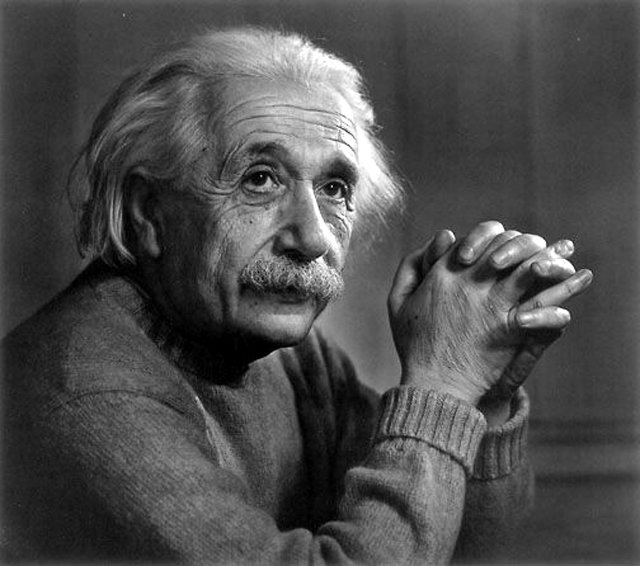
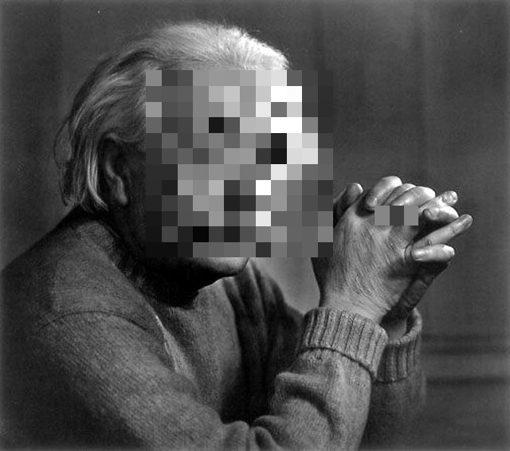
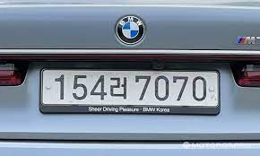
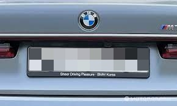

# **Blur-Out-Face-and-License-Plate**

---
# Project

Our project is to find and mosaic people's faces and car license plates.<br>This project is based on "Face-Detection-OpenCV" and "License_Plate_Detection_Pytorch".

---
## Requirements
Required packages with versions can be found in the requirements.txt file.
Additionally, the following commands allow the necessary packages to be installed.
```
pip install requirements.txt
```


---
## Commands to run detection

```
python main.py --image /data/mosaic_test.jpg
```

---
## Example
|                origin                |              mosaic              |               
| :----------------------------------: | :--------------------------------------: | 
|       |     |     
|       |  |


---
### Reference
Detecting face: [Face-Detection-OpenCV]
(https://github.com/informramiz/Face-Detection-OpenCV)

Dectecting car license plate: [License_Plate_Detection_Pytorch](https://github.com/xuexingyu24/License_Plate_Detection_Pytorch)

Mosaic: 
